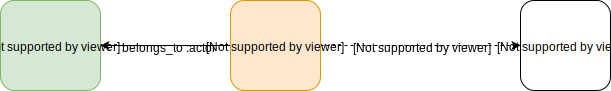

# Icalia A2 gem

The Icalia "A2" gem (which stands for "Authentication & Authorization") is a
library that combines several useful ruby libraries to provide an opinionated
auth structure for your rails apps.

## Installation

Add this line to your application's Gemfile:

```ruby
gem 'authegy'
```

And then execute:

    $ bundle

Or install it yourself as:

    $ gem install authegy

## Usage

### Basic Use Case: The User & Role models

- Use only a single "User" class, with several roles associated to it - instead
  of having multiple "user" classes, which tend to have duplicated code &
  functionality between them.
- Roles can also be optionally associated to different "Resource" models, so we
  can limit the authorization to certain objects. Examples:
  - "User 2" is an "Administrator" of "Website 2" (so he/she can change the
    Website 2's URL)
  - "User 3" is a "Procurement Manager" of "Company 4" (so he/she can place
    orders on behalf of the Company 4)




## Development

After checking out the repo, run `bin/setup` to install dependencies. Then, run `rake spec` to run the tests. You can also run `bin/console` for an interactive prompt that will allow you to experiment.

To install this gem onto your local machine, run `bundle exec rake install`. To release a new version, update the version number in `version.rb`, and then run `bundle exec rake release`, which will create a git tag for the version, push git commits and tags, and push the `.gem` file to [rubygems.org](https://rubygems.org).

## Contributing

Bug reports and pull requests are welcome on GitHub at https://github.com/[USERNAME]/a2. This project is intended to be a safe, welcoming space for collaboration, and contributors are expected to adhere to the [Contributor Covenant](http://contributor-covenant.org) code of conduct.

## License

The gem is available as open source under the terms of the [MIT License](https://opensource.org/licenses/MIT).

## Code of Conduct

Everyone interacting in the A2 project’s codebases, issue trackers, chat rooms and mailing lists is expected to follow the [code of conduct](https://github.com/[USERNAME]/a2/blob/master/CODE_OF_CONDUCT.md).
