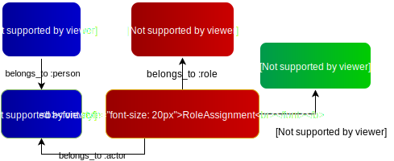

# Authegy

The Authegy gem is a library that combines several top-grade ruby libraries to
provide an opinionated authentication and role-based authorization solution for
your rails apps.

The following libraries are used as the base of Authegy:
- Devise
- Doorkeeper

These libraries are used following a particular set of rules:

- Only a single `User` class: whereas `devise` allows for multiple
  "authenticatable" models, we're going use single class, to which we can assign
  different roles instead.
- The "profile" user data - such as names, email, phone, etc. - is extracted
  into a separate `Person` model. We actually can create `Person` records
  without an associated user, enabling us to manage a "contact list".
- Roles added to a given person can be assigned either unlimited, or scoped to a
  given "resource" object.
- The only way of giving access to an app's RESTAPI (where available) is through
  an OAuth2 flow (i.e. access token, etc) - that's where Doorkeeper comes into
  play. Given that our most common use case for RESTAPIs is to be consumed by
  non-confidential apps (Single-page apps, mobile apps, etc), we're avoiding
  other solutions such as Devise JWT, Devise Token Auth, etc.
- All OAuth2 (doorkeeper) apps will have an owner, and admin roles may be
  given to other people to manage the apps.
- Restrictions coming from the OAuth2 access token permissions will be added to
  those already in effect from roles for the token's resource owner.

## Getting started

Add this line to your application's Gemfile:

```ruby
gem 'authegy', '~> 0.0.2'
```

Then run `bundle install`.

Next, you'll need to run the generator:

    $ rails generate authegy:install

The install generator will run the install routines for the required libraries (
devise, etc), and will also generate the required models, database migration and
routes to start working with the authegy model.

### Model methods

There are several methods available to the `Person` and `User` models, and are
very similar to the methods found at other RBAC libraries:

```ruby

# Create a person:
example_person = Person.create first_name: 'Example', last_name: 'Person', email: 'first@example.com'

# Assign a role to this person - The role will be created if it doesn't exist:
example_person.assign_role :administrator

# Assign a user to this person - he/she will now have the ability to sign-in:
example_user = example_person.create_user! password: '123456'

# You can assign roles scoped to a particular resource:
example_person.assign_role :moderator, Discussion.last

# You can test if the person has a role:
example_person.has_role? :moderator, Discussion.last

# All the role management methods are available to the `User` model via method
# delegation:
example_user.assign_role :moderator, Discussion.first
example_user.has_role? :moderator, Discussion.first

```

## The Authegy model, in detail



- We extracted the `User` fields not fundamental to the process of
  authentication into the model `Person`. This allows us to also cover cases in
  which we are asked to manage a "contact list", with people that either can
  sign-in or not. Notice the `email` field is also moved to the `Person` model -
  we provide the code required for Devise to look in the `people` table.
- The way we assign roles to a person is using the `RoleAssignment` model. This
  model also allows us to optionally specify a `resource` to which the assigned
  role will be limited (or scoped). Notice how the `RoleAssignment` is separated
  from the actual `Role` model, achieving a higher level of database
  normalization.

## Development

After checking out the repo, run `bin/setup` to install dependencies. Then, run
`rake spec` to run the tests. You can also run `bin/console` for an interactive
prompt that will allow you to experiment.

To install this gem onto your local machine, run `bundle exec rake install`. To
release a new version, update the version number in `version.rb`, and then run
`bundle exec rake release`, which will create a git tag for the version, push
git commits and tags, and push the `.gem` file to
[rubygems.org](https://rubygems.org).

## Contributing

Bug reports and pull requests are welcome on GitHub at
https://github.com/vovimayhem/authegy-gem. This project is intended to be a safe,
welcoming space for collaboration, and contributors are expected to adhere to
the [Contributor Covenant](http://contributor-covenant.org) code of conduct.

## License

The gem is available as open source under the terms of the
[MIT License](https://opensource.org/licenses/MIT).

## Code of Conduct

Everyone interacting in the Authegy project’s codebases, issue trackers, chat
rooms and mailing lists is expected to follow the
[Code of Conduct](https://github.com/vovimayhem/authegy-gem/blob/master/CODE_OF_CONDUCT.md).
